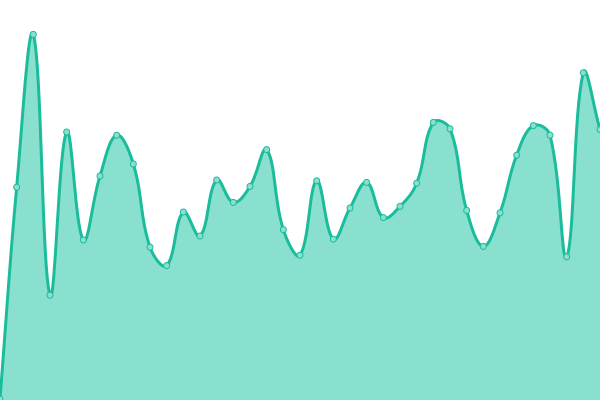
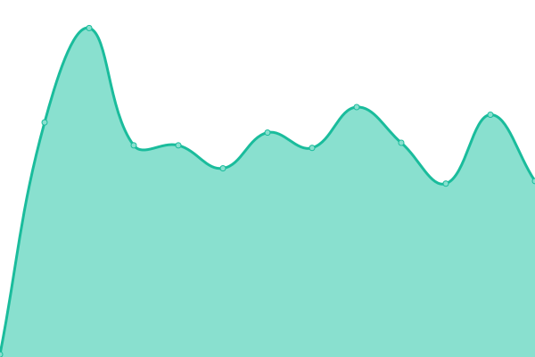
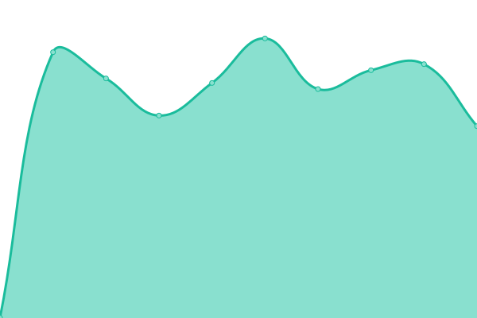

# [📈 Live Status](https://demo.upptime.js.org): <!--live status--> **🟧 Partial outage**

This repository contains the open-source uptime monitor and status page for [Upptime](https://upptime.js.org), powered by [Upptime](https://github.com/upptime/upptime).

With [Upptime](https://upptime.js.org), you can get your own unlimited and free uptime monitor and status page, powered entirely by a GitHub repository. We use [Issues](https://github.com/upptime/upptime/issues) as incident reports, [Actions](https://github.com/LimeCommerce/upptime/actions) as uptime monitors, and [Pages](https://demo.upptime.js.org) for the status page.

<!--start: status pages-->
<!-- This summary is generated by Upptime (https://github.com/upptime/upptime) -->
<!-- Do not edit this manually, your changes will be overwritten -->
<!-- prettier-ignore -->
| URL | Status | History | Response Time | Uptime |
| --- | ------ | ------- | ------------- | ------ |
|  [LimeCommerce Production](https://limecommerce.com) | 🟩 Up | [lime-commerce-production.yml](https://github.com/LimeCommerce/upptime/commits/HEAD/history/lime-commerce-production.yml) | 

 266ms
     
 | 

<a href="https://uptime.limecommerce.work/history/lime-commerce-production">100.00%</a>
    

|  [Coral Island](https://coralisland.wiki/) | 🟩 Up | [coral-island.yml](https://github.com/LimeCommerce/upptime/commits/HEAD/history/coral-island.yml) | 

 1916ms
     
 | 

<a href="https://uptime.limecommerce.work/history/coral-island">100.00%</a>
    

|  [Google](https://www.google.com/) | 🟩 Up | [google.yml](https://github.com/LimeCommerce/upptime/commits/HEAD/history/google.yml) | 

 89ms
     
 | 

<a href="https://uptime.limecommerce.work/history/google">100.00%</a>
    

|  [Mebel](https://mebel.limecommerce.work) | 🟥 Down | [mebel.yml](https://github.com/LimeCommerce/upptime/commits/HEAD/history/mebel.yml) | 

 873ms
     
 | 

<a href="https://uptime.limecommerce.work/history/mebel">76.14%</a>
    

<!--end: status pages-->

[**Visit our status website →**](https://demo.upptime.js.org)

## 📄 License

- Powered by: [Upptime](https://github.com/upptime/upptime)
- Code: [MIT](./LICENSE) © [Anand Chowdhary](https://anandchowdhary.com), supported by [Pabio](https://pabio.com)
- Data in the `./history` directory: [Open Database License](https://opendatacommons.org/licenses/odbl/1-0/)
