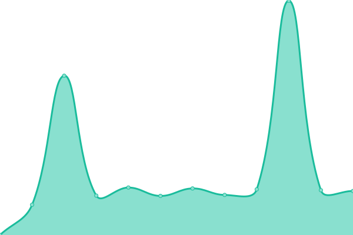
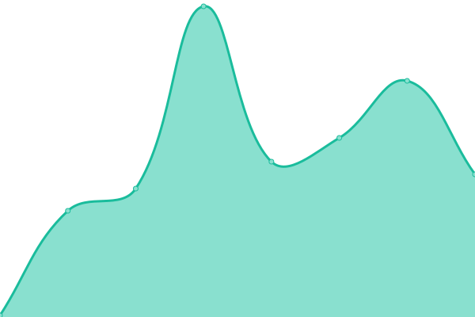
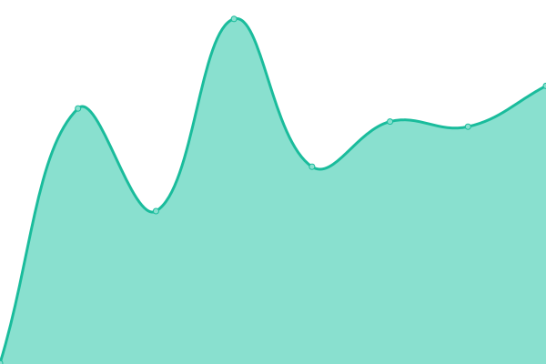

# [📈 Live Status](https://demo.upptime.js.org): <!--live status--> **🟩 All systems operational**

This repository contains the open-source uptime monitor and status page for [Upptime](https://upptime.js.org), powered by [Upptime](https://github.com/upptime/upptime).

With [Upptime](https://upptime.js.org), you can get your own unlimited and free uptime monitor and status page, powered entirely by a GitHub repository. We use [Issues](https://github.com/upptime/upptime/issues) as incident reports, [Actions](https://github.com/LimeCommerce/upptime/actions) as uptime monitors, and [Pages](https://demo.upptime.js.org) for the status page.

<!--start: status pages-->
<!-- This summary is generated by Upptime (https://github.com/upptime/upptime) -->
<!-- Do not edit this manually, your changes will be overwritten -->
<!-- prettier-ignore -->
| URL | Status | History | Response Time | Uptime |
| --- | ------ | ------- | ------------- | ------ |
|  [#27654 LimeCommerce Production](https://limecommerce.com) | 🟩 Up | [27654-lime-commerce-production.yml](https://github.com/LimeCommerce/upptime/commits/HEAD/history/27654-lime-commerce-production.yml) | 

 335ms
     
 | 

<a href="https://uptime.limecommerce.work/history/27654-lime-commerce-production">100.00%</a>
    

|  [#86723 Coral Island](https://coralisland.wiki/) | 🟩 Up | [86723-coral-island.yml](https://github.com/LimeCommerce/upptime/commits/HEAD/history/86723-coral-island.yml) | 

 1904ms
     
 | 

<a href="https://uptime.limecommerce.work/history/86723-coral-island">100.00%</a>
    

|  [#38492 Yamada BEST](https://yamadabestid.com) | 🟩 Up | [38492-yamada-best.yml](https://github.com/LimeCommerce/upptime/commits/HEAD/history/38492-yamada-best.yml) | 

 166ms
     
 | 

<a href="https://uptime.limecommerce.work/history/38492-yamada-best">100.00%</a>
    

|  [#71530 Jade](https://jade-jakarta.com) | 🟩 Up | [71530-jade.yml](https://github.com/LimeCommerce/upptime/commits/HEAD/history/71530-jade.yml) | 

 107ms
     
 | 

<a href="https://uptime.limecommerce.work/history/71530-jade">100.00%</a>
    

|  [#26981 Nihon](https://nihonmart.id) | 🟩 Up | [26981-nihon.yml](https://github.com/LimeCommerce/upptime/commits/HEAD/history/26981-nihon.yml) | 

 1781ms
     
 | 

<a href="https://uptime.limecommerce.work/history/26981-nihon">100.00%</a>
    

|  [#54027 Rodalink](https://www.rodalink.com) | 🟩 Up | [54027-rodalink.yml](https://github.com/LimeCommerce/upptime/commits/HEAD/history/54027-rodalink.yml) | 

 2889ms
     
 | 

<a href="https://uptime.limecommerce.work/history/54027-rodalink">100.00%</a>
    

|  [#19836 CNF](https://cnfstore.com) | 🟩 Up | [19836-cnf.yml](https://github.com/LimeCommerce/upptime/commits/HEAD/history/19836-cnf.yml) | 

 133ms
     
 | 

<a href="https://uptime.limecommerce.work/history/19836-cnf">100.00%</a>
    

|  [#67394 Yeva](https://yeva.asia) | 🟩 Up | [67394-yeva.yml](https://github.com/LimeCommerce/upptime/commits/HEAD/history/67394-yeva.yml) | 

 481ms
     
 | 

<a href="https://uptime.limecommerce.work/history/67394-yeva">99.91%</a>
    

<!--end: status pages-->

[**Visit our status website →**](https://demo.upptime.js.org)

## 📄 License

- Powered by: [Upptime](https://github.com/upptime/upptime)
- Code: [MIT](./LICENSE) © [Anand Chowdhary](https://anandchowdhary.com), supported by [Pabio](https://pabio.com)
- Data in the `./history` directory: [Open Database License](https://opendatacommons.org/licenses/odbl/1-0/)
